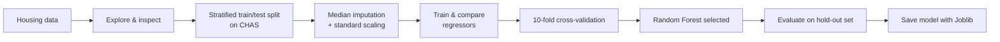

# 🐉 Dragon Real Estates

> **A machine-learning price estimator for residential properties.**  
> Turn neighbourhood and property characteristics into an estimated median home value.

<p align="center">
  
  
  
  
</p>

<p align="center">
  <strong>Libraries, tools &amp; skills used</strong><br><br>
  
  
  
  
  
  
  <br>
  
  
  
  
</p>

---

## ✨ At a glance

| | |
|---|---|
| **Problem** | Estimate a property's median value (`MEDV`, in $1,000s) from local and structural indicators. |
| **Data** | 506 observations · 13 input features · 1 regression target |
| **Selected model** | `RandomForestRegressor` |
| **Validation** | 10-fold cross-validation and a stratified 20% hold-out test set |
| **Final test RMSE** | **2.95** (about **$2,950** in dataset units) |
| **Reusable artefact** | `Dragon_real_estates.joblib` |

## 🎯 Why build this model?

Property valuation depends on many signals at once—such as room count, crime rate, tax rate, access to highways, and neighbourhood conditions. Estimating value manually can be slow and inconsistent. This project explores how supervised machine learning can learn the relationship between those signals and home value, providing a fast, repeatable estimate to support analysis and decision-making.

> **Important:** This is a learning/project model built from the included dataset. It is not a substitute for a licensed appraisal or a production valuation system.

## 🧭 How it works



## 🧠 Modelling strategy

1. **Explore the data** — inspect distributions, correlations, and feature relationships; the notebook also examines useful attribute combinations.
2. **Protect the test set** — use `StratifiedShuffleSplit` with `CHAS` so the Charles River indicator keeps a similar 0/1 balance in training and test data.
3. **Prepare features consistently** — fill missing numeric values with the median and standardize features in a scikit-learn `Pipeline`. The source data has 5 missing `RM` (average rooms) values.
4. **Compare candidates** — train Linear Regression, Decision Tree Regression, and Random Forest Regression models.
5. **Validate fairly** — compare models using 10-fold cross-validation with RMSE, then evaluate the selected model on the untouched test set.
6. **Persist the winner** — serialize the trained Random Forest to a `.joblib` file so it can be loaded without retraining.

## 📊 Model comparison

Lower RMSE is better. Cross-validation scores below are the mean across 10 folds.

| Candidate | Train RMSE | Cross-validation RMSE | CV spread |
|---|---:|---:|---:|
| Linear Regression | 4.84 | 5.04 | ± 1.06 |
| Decision Tree Regressor | 0.00 | 4.32 | ± 0.65 |
| **Random Forest Regressor** | **1.29** | **3.34** | **± 0.72** |

The decision tree's perfect training score is a warning sign of overfitting. Random Forest achieved the best cross-validation result and was selected. Its final evaluation on the held-out test set produced an RMSE of **2.95**.

## 🗂️ Dataset & features

The target is `MEDV`, the median value of owner-occupied homes, measured in **$1,000s**. The model uses the remaining 13 numeric fields:

| Feature | Meaning |
|---|---|
| `CRIM`, `ZN`, `INDUS` | Crime rate, residential-zoning proportion, and non-retail business proportion |
| `CHAS` | Whether the tract borders the Charles River |
| `NOX`, `RM`, `AGE` | Nitric-oxide concentration, average rooms, and age of owner-occupied units |
| `DIS`, `RAD`, `TAX` | Distance to employment centres, highway-access index, and property-tax rate |
| `PTRATIO`, `B`, `LSTAT` | Pupil–teacher ratio, a legacy demographic field, and lower-status population percentage |

> **Data note:** The included data follows the historical Boston Housing dataset format. Its `B` and `LSTAT` fields reflect outdated social terminology and may embed harmful historical assumptions. They are retained here only to reproduce the learning dataset; do not use sensitive or demographic proxies in a real-world property-valuation system.

## 🧰 Libraries, tools & skills used

### Libraries

| Library | Used for |
|---|---|
| `pandas` | Loading, inspecting, and manipulating tabular data |
| `numpy` | Numerical operations and RMSE calculations |
| `matplotlib` | Histograms and exploratory visualizations |
| `scikit-learn` | Splitting, preprocessing, pipelines, models, metrics, and cross-validation |
| `joblib` | Saving the trained model for reuse |

### Tools

| Tool | Role |
|---|---|
| **Jupyter Notebook** | Interactive experimentation and documented training workflow |
| **Python** | Model development and inference environment |
| **Git** *(optional)* | Recommended for versioning notebooks, data changes, and model experiments |

### Data-science skills demonstrated

- Exploratory data analysis: summaries, histograms, correlations, and feature combinations
- Data quality handling: median imputation for missing values
- Feature preprocessing: standardization in a reusable pipeline
- Responsible splitting: stratified train/test partitioning
- Regression modelling: baseline, tree, and ensemble methods
- Evaluation: RMSE, 10-fold cross-validation, and overfitting checks
- Model persistence: export and reload a trained estimator

## 🚀 Run the project

1. Clone or download this project.
2. Create and activate a Python virtual environment.
3. Install the dependencies:

```bash
pip install pandas numpy matplotlib scikit-learn joblib jupyter
```

4. Start Jupyter from the project directory:

```bash
jupyter notebook
```

5. Open **`Dragon Real Estates.ipynb`** and run the cells from top to bottom.

## 🔮 Load the saved model

The saved estimator is available at `Dragon_real_estates.joblib`.

```python
from joblib import load

model = load("Dragon_real_estates.joblib")
predictions = model.predict(prepared_features)
```

Use the same preprocessing learned in the notebook before passing new feature rows to this model. Each row must contain the 13 predictor columns in the training-data order and must not include `MEDV`.

> **Deployment note:** The current `.joblib` file contains the fitted Random Forest estimator, while the imputation and scaling steps are created separately in the notebook. For a production application, save one combined scikit-learn pipeline so preprocessing and prediction always stay in sync.

## 🌱 Benefits & practical uses

| Benefit | What it enables |
|---|---|
| **Fast estimates** | Generate value estimates in seconds after the model is loaded. |
| **Consistent decisions** | Apply the same data-driven approach to every comparable record. |
| **Non-linear patterns** | Random Forest can capture interactions that a simple linear model may miss. |
| **Reusable model file** | Integrate the exported artefact into a script, API, dashboard, or web app. |
| **Learning foundation** | A clear starting point for feature engineering, tuning, monitoring, and deployment. |

## 📁 Project structure

```text
.
├── Dragon Real Estates.ipynb       # Main exploration, training, and evaluation notebook
├── Model Testing.ipynb             # Additional model experimentation
├── data.csv                        # Source dataset
├── housing.data / housing.names    # Dataset files and field definitions
├── Dragon_real_estates.joblib      # Saved Random Forest model
└── Output from different Models.txt # Recorded comparison results
```

## ⚠️ Next improvements

- Package preprocessing and the estimator into one end-to-end pipeline before deployment.
- Add hyperparameter tuning and compare it against the current Random Forest baseline.
- Track feature importance and prediction error across neighbourhood segments.
- Add automated tests, dependency pinning, and a small prediction API or UI.
- Retrain with current, location-specific market data before any real-world use.

---

Built as a practical regression and model-selection project for real-estate price estimation.
