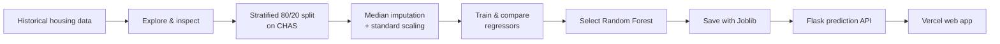

# 🐉 Dragon Real Estates

> A deployed machine-learning web app that estimates Boston-area home values from 13 neighbourhood and property indicators.

<div align="center">

## 🚀 Try the live application

<a href="https://dragon-real-estates.vercel.app/">
  
</a>

*Enter property details to Get predicted value · Powered by  Random Forest Regression Model*

</div>

<p align="center">
  <a href="https://dragon-real-estates.vercel.app/"></a>
  
  
  
</p>

<p align="center">
  <strong>Libraries, tools &amp; skills used</strong><br><br>
  
  
  
  
  
  
  <br>
  
  
  
  
</p>

---

## ✨ Live application

**[Open Dragon Real Estates →](https://dragon-real-estates.vercel.app/)**

The deployed app provides a responsive form for all 13 model inputs. Submit the form to receive an estimated `MEDV` value without retraining the model. The live service is hosted on **Vercel** and powered by a Flask serverless function.

| Capability | Implementation |
|---|---|
| Browser experience | HTML form with labelled numeric fields and inline prediction/error feedback |
| Prediction endpoint | `POST /api/predict` |
| Input validation | Requires exactly 13 numeric feature values |
| Model inference | Median imputation → standard scaling → Random Forest prediction |
| Deployment | `vercel.json` routes incoming requests to `api/index.py` |

## 🎯 Problem statement

Property value is affected by many interacting factors—room count, local taxes, crime rate, air quality, and access to employment, among others. Manual valuation is time-consuming and can be inconsistent. This project uses supervised regression to learn from historical housing data and return a quick, repeatable estimate of a home's median value.

> **Scope:** This is an educational model based on historical Boston Housing data. It is not an appraisal tool and must not be used for lending, pricing, or other real-world decisions about people or property.

## 🧭 End-to-end workflow



## 📊 Model results

The project compares three regression models using 10-fold cross-validation. Lower RMSE is better.

| Candidate | Train RMSE | Mean cross-validation RMSE | CV spread |
|---|---:|---:|---:|
| Linear Regression | 4.84 | 5.04 | ± 1.06 |
| Decision Tree Regressor | 0.00 | 4.32 | ± 0.65 |
| **Random Forest Regressor** | **1.29** | **3.34** | **± 0.72** |

The perfect Decision Tree training score signals overfitting. Random Forest had the best validation performance and was selected. The currently saved model produces a **2.98 RMSE** on the reproducible 102-row stratified hold-out set—approximately **$2,980**, since `MEDV` is expressed in $1,000s.

## 🧠 Strategy used

1. **Exploration** — inspect distributions, correlations, scatter plots, and useful feature combinations.
2. **Representative split** — use `StratifiedShuffleSplit` on `CHAS` to preserve its 0/1 distribution across training and test data.
3. **Data preparation** — impute the five missing `RM` values with the median, then standardize numeric features in a scikit-learn pipeline.
4. **Model selection** — compare Linear Regression, Decision Tree Regression, and Random Forest Regression.
5. **Evaluation** — use RMSE, 10-fold cross-validation, and a hold-out test set to check generalization.
6. **Deployment** — reload the trained `.joblib` model, rebuild the matching preprocessing pipeline from the deterministic training split, and serve predictions through Flask on Vercel.

## 🗂️ Data

The application uses 506 records from the historical **Boston Housing** dataset. It has 13 numerical predictors and the `MEDV` target: median value of owner-occupied homes in **$1,000s**.

| Feature group | Fields |
|---|---|
| Neighbourhood & zoning | `CRIM`, `ZN`, `INDUS`, `CHAS` |
| Environment & accessibility | `NOX`, `DIS`, `RAD`, `TAX` |
| Housing characteristics | `RM`, `AGE` |
| Socioeconomic indicators | `PTRATIO`, `B`, `LSTAT` |

The dataset documentation is included in [`housing.names`](housing.names). `B` and `LSTAT` are legacy fields with outdated terminology and may encode harmful historical assumptions. They are included solely to reproduce this learning dataset and should be removed or carefully reconsidered for any modern model.

## 🧰 Stack

| Category | Used technologies |
|---|---|
| Data & numerical work | `pandas`, `numpy` |
| Visual exploration | `matplotlib`, Jupyter Notebook |
| Machine learning | `scikit-learn` — `SimpleImputer`, `StandardScaler`, `Pipeline`, `StratifiedShuffleSplit`, cross-validation, and regressors |
| Model persistence | `joblib` |
| Web/API | Flask, HTML, CSS, browser Fetch API |
| Hosting | Vercel serverless Python function |

## 🚀 Run locally

### Prerequisites

- Python 3.9 or later
- `pip`

### Setup

```bash
git clone <your-repository-url>
cd "Dragon Real Estates"
python -m venv .venv
```

Activate the virtual environment, then install the web-app dependencies:

```bash
pip install -r requirements.txt
python api/index.py
```

Open [http://127.0.0.1:5000](http://127.0.0.1:5000) in your browser.

To reproduce the model exploration, install the notebook packages and open the main notebook:

```bash
pip install pandas matplotlib jupyter
jupyter notebook "Dragon Real Estates.ipynb"
```

## 🔌 API usage

Send a JSON request containing the 13 features in this exact order:

`CRIM, ZN, INDUS, CHAS, NOX, RM, AGE, DIS, RAD, TAX, PTRATIO, B, LSTAT`

```bash
curl -X POST https://dragon-real-estates.vercel.app/api/predict \
  -H "Content-Type: application/json" \
  -d '{"features":[0.00632,18,2.31,0,0.538,6.575,65.2,4.09,1,296,15.3,396.9,4.98]}'
```

Example response:

```json
{
  "prediction": 26.034000000000006
}
```

`prediction` is in $1,000s; the example corresponds to approximately **$26,034** in the dataset's units.

## ✅ Verify the API locally

The included smoke test sends the same valid 13-feature request to the Flask application:

```bash
python _validate_api.py
```

Expected result: an HTTP `200` response and a JSON prediction.

## 📁 Project structure

```text
.
├── api/
│   └── index.py                       # Flask UI and prediction API
├── Dragon Real Estates.ipynb          # Exploration, training, and evaluation
├── Model Testing.ipynb                # Saved-model inference experiment
├── Dragon_real_estates.joblib         # Trained Random Forest estimator
├── data.csv                           # App dataset used to recreate preprocessing
├── housing.data                       # Original-format housing data
├── housing.names                      # Dataset source and field documentation
├── Output from different Models.txt   # Cross-validation records
├── requirements.txt                   # Runtime dependencies
├── vercel.json                        # Vercel serverless routing configuration
└── _validate_api.py                   # Local API smoke test
```

## ⚠️ Limitations & next steps

- The model is trained on an old, small dataset and does not reflect current property markets.
- The current model artifact contains the estimator only; the deployed API intentionally recreates matching preprocessing. A future version should save one complete preprocessing-and-model pipeline.
- Set `random_state` and pin package versions for fully reproducible retraining.
- Add stronger request validation, API tests, monitoring, and a versioned model-release process.
- Replace sensitive legacy inputs with ethically appropriate, current, and legally reviewed data before any real-world use.

---

Built as an educational end-to-end machine-learning project: from exploratory analysis to a live Vercel deployment.
